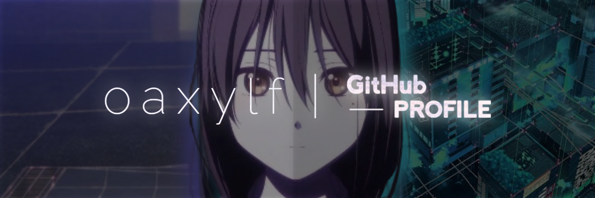

<h1 align="center">Hi 👋, I'm Ray!</h1>

<div align="center">
<a href="https://git.io/typing-svg"></a>
</div>

```js
function Welcome() {
    const greetings = "Greetings! I'm Ray. I am ";
    let age = 18;
    let life_now = ". Currently I am having a life on college!";
}

Welcome();
```

<div align="right">
  

  
</div>

---

<div align="center">
  
</div>

<strong>✨ Hobby:</strong> I usually like to read some books, writing diary, build something on my head, walking around, and absolutely watching anime after stressing out code. <br />
<strong>🌴 Favorite Anime: </strong>[Hello World](https://hello-world-2019.fandom.com/wiki/Hello_World_(Film))<br />
<br />
<strong>🖥️ Preference OS used: </strong> <br />
   <br />

---

<h2>Tech Stack Language</h2>

<h3 align="center">Favorited</h3>

<div align="center">

   
</div>

<h3 align="center">Currently Learning</h3>
<div align="center">

   

---

</div>

<h2>Framework & Library</h2>

<h3 align="center">Favorited</h3>

<div align="center">

     
</div>

<h3 align="center">Currently Learning</h3>
<div align="center">

       

---

</div>

<h2>Achievements</h2>
<h3 align="center">Github Stats</h3>
<div align="center">

  

<h3 align="center">Progress</h3>

[](https://git.io/streak-stats)

---

</div>

<h2>Social Media</h2>
<div align="center">

<a href="https://discord.com/users/887565456880324668/"></a> <a href="https://x.com/oaxylf"></a> <a href="https://t.me/oaxylf"></a> <a href="https://www.youtube.com/@oaxylf"></a> <a href="https://instagram.com/oaxylf.dev"></a> <a href="https://tiktok.com/@oaxylf"></a> <a href="https://facebook.com/oaxylf.dev"></a>

</div>

 
